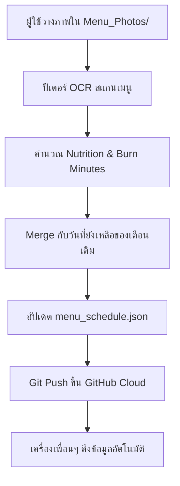

# 🍱 Peter Food Menu Sync & Nutrition Protocol

ทักษะและมาตรฐานการทำงานสำหรับ **ปีเตอร์ (Peter)** ในการประมวลผล อัปเดต และดูแลระบบ **Peter Food Menu Alert**

---

## 📌 กฎเหล็กที่ต้องปฏิบัติทุกครั้ง (Strict Execution Rules)

1. **Seamless Multi-Month Merge (ห้ามลบวันที่ยังมาไม่ถึง):**
   * เมื่อมีเมนูเดือนใหม่ (เช่น เดือนกันยายน) เข้ามา ห้ามทับไฟล์เดิมทั้งหมดจนวันของเดือนปัจจุบันหายไป
   * ให้อ่านวันที่ยังเหลือของเดือนปัจจุบัน (ตั้งแต่วันนี้เป็นต้นไปจนสิ้นเดือน) แล้วนำเมนูของเดือนใหม่ไป **ต่อท้าย (Append)** เสมอ
   * ตั้งค่า `monthTitle` ให้ครอบคลุม เช่น `"สิงหาคม - กันยายน 2569"`

2. **Smart Nutrition Calculation (มาตรฐานข้าวสวย 1 ทัพพี):**
   * อาหารทุกเมนูต้องมีข้อมูล `nutrition` (หรือคำนวณผ่าน `resolvedNutrition`):
     * `calories`: พลังงานรวมต่อ 1 เสิร์ฟ โดยคิดรวม **ข้าวสวย 1 ทัพพี (~80 kcal / Carbs 18g)** + กับข้าวทั้งหมด + ของหวาน (ถ้ามี)
     * `protein`: โปรตีน (กรัม)
     * `carbs`: คาร์โบไฮเดรต (กรัม)
     * `fat`: ไขมัน (กรัม)
     * `runningMinutes`: เวลาวิ่งเพื่อเบิร์นแคลอรี่มื้อนี้ออก (~10 kcal/นาที)
     * `walkingMinutes`: เวลาเดินเร็วเพื่อเบิร์นแคลอรี่ (~5.8 kcal/นาที)
     * `healthTip`: คำแนะนำสุขภาพสั้นๆ 1 บรรทัด

3. **Zero Sound on Update (ห้ามส่งเสียงหรือเด้งเตือนตอนเปิด/อัปเดต):**
   * การซิงค์ข้อมูลและอัปเดตเวอร์ชันต้องเป็น **Silent Background Operation** 100%
   * เสียงเตือนและป็อปอัปจะทำงานเฉพาะเวลาที่ผู้ใช้ตั้งไว้ (เช่น 10:50 น.) หรือเมื่อกดปุ่มทดสอบด้วยตัวเองเท่านั้น

4. **Universal Binary Architecture (Intel + Apple Silicon):**
   * คอมไพล์โปรแกรมทั้ง 2 Architecture เสมอ:
     ```bash
     swiftc -O -target arm64-apple-macos11.0 PeterFoodMenuApp.swift -o /tmp/PeterFoodMenu_arm64
     swiftc -O -target x86_64-apple-macos11.0 PeterFoodMenuApp.swift -o /tmp/PeterFoodMenu_x86_64
     lipo -create -output PeterFoodMenu /tmp/PeterFoodMenu_arm64 /tmp/PeterFoodMenu_x86_64
     ```

5. **Single-Instance Enforcement:**
   * ตัวโปรแกรมต้องมี POSIX Lock (`lockf`) เพื่อป้องกันการเปิดโปรแกรมซ้ำซ้อนจนเกิดหลายไอคอนบน Menu Bar

---

## 🔄 ลำดับขั้นตอนการอัปเดตเมนูประจำเดือน (Step-by-Step Workflow)



### คำสั่งด่วนสำหรับสแกนและคำนวณ:
```bash
node /Users/art/Desktop/ART_JOB/05_Research_and_Development/PETER_FOOD_MENU_ALERT/Original/nutrition_calculator.js
```
